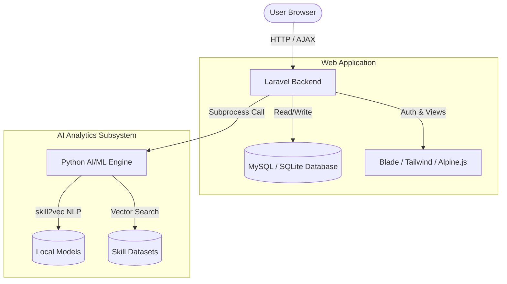

<p align="center">
  
  
  
  
</p>

<h1 align="center">EduCareer</h1>

> A full-stack AI-powered career guidance platform that bridges the gap between CVs and dream careers through intelligent skill extraction and mapping.

<p align="center">
  Developed by <br>
  <strong>Muhammad Farrukh Javed</strong><br>
  <a href="https://github.com/mfarrukhjaved-381">GitHub</a> • <a href="https://mfarrukhjaved.com/">Portfolio</a>
</p>

## Overview

### The Problem
Job seekers often do not know exactly what technical or soft skills they lack for their desired roles. Meanwhile, career advisors struggle to provide data-driven, personalized recommendations at scale. Existing solutions are either too generic or locked behind proprietary enterprise paywalls.

### The Solution
EduCareer provides an open-source platform that uses Natural Language Processing (NLP) to parse a user's CV, extract their skills, and map them against current industry requirements. By identifying the specific skill gap between a user's current profile and their target career, the platform can recommend tailored courses and viable job paths.

## Scope, Honestly

### What It Does
EduCareer successfully parses uploaded CVs, extracts skills, generates vector embeddings for those skills using a custom `skill2vec` model, and calculates vector similarity against a predefined dataset of job roles and courses. It provides a complete web interface for users to register, upload their CVs, and view their personalized career analytics and skill gaps.

### What It Does Not Do
- **It does not automatically apply to jobs.**
- **It does not scrape live job boards.** Real-time job board integration requires connecting a third-party API (like LinkedIn or Indeed) to the existing endpoints.
- **It does not guarantee employment.** The platform is strictly an analytical guidance tool.

> **Status:** Development / Beta

## Features

### Core
- **Smart CV Analysis:** Extract technical and soft skills directly from uploaded resumes using NLP.
- **Career Path Mapping:** AI-driven recommendations matching user profiles to viable career trajectories.
- **Skill Gap Visualization:** Dashboards highlighting missing skills required for target jobs.

### Recommendations
- **Dynamic Job Matching:** Recommends specific roles based on vector similarity (`skill2vec`).
- **Targeted Upskilling:** Suggests courses tailored to bridge individual skill gaps.

### Security & Administration
- **Role-Based Access Control (RBAC):** Distinct workflows for admins, career advisors, and standard users.
- **Authentication:** Secure login and registration.

## Architecture



## Tech Stack

### Frontend
- Blade Templating
- Tailwind CSS
- Alpine.js
- Vite

### Backend
- Laravel 12 (PHP 8.2)

### Database
- MySQL / SQLite

### AI & Machine Learning
- Python 3.x
- Gensim
- Scikit-Learn
- Pandas

## Prerequisites

- **PHP** >= 8.2
- **Composer** >= 2.x
- **Node.js** >= 18 and **npm** >= 9
- **Python** >= 3.9
- **MySQL** / **MariaDB** (or SQLite for local testing)

## Quick Start

### Clone

```bash
git clone https://github.com/mfarrukhjaved-381/educareer.git
cd educareer
```

### Web Application Setup (Laravel)

```bash
cd frontend-backend

# Install dependencies
composer install
npm install

# Configure environment
cp .env.example .env
php artisan key:generate

# Run database migrations
php artisan migrate

# Start the application
php artisan serve & npm run dev
```

### AI/ML Engine Setup (Python)

```bash
cd ../ai-ml

# Create and activate a virtual environment
python3 -m venv venv
source venv/bin/activate  # On Windows: venv\Scripts\activate

# Install required ML packages
pip install pandas scikit-learn gensim numpy
```

## Environment Variables

Create a `.env` file in the `frontend-backend` directory based on `.env.example`.

| Variable | Required | Description | Example |
| -------- | -------- | ----------- | ------- |
| `APP_ENV` | Yes | Application environment | `local` |
| `DB_CONNECTION` | Yes | Database driver | `mysql` |
| `DB_DATABASE` | Yes | Database name or absolute SQLite path | `educareer` |
| `GOOGLE_CLIENT_ID` | No | OAuth Client ID for Google Login | `123...apps.googleusercontent.com` |
| `GOOGLE_CLIENT_SECRET` | No | OAuth Client Secret for Google Login | `[NEEDS CONFIRMATION]` |

## Usage

### Running ML Scripts Manually
While the Laravel backend handles standard user interactions, developers can manually run or retrain the machine learning pipelines:

```bash
cd ai-ml
source venv/bin/activate

# Generate job recommendations based on a sample input
python scripts/job_recommendations.py

# Retrain the skill2vec model with updated datasets
python scripts/train_skill2vec.py
```

## Development

To format and work on the Laravel application locally:

```bash
# Compile frontend assets for development
npm run dev

# Build frontend assets for production
npm run build

# Clear application cache
php artisan optimize:clear
```

## Testing

Run the automated test suite for the Laravel backend:

```bash
cd frontend-backend
php artisan test
```

## Contributing

Contributions are welcome.

1. Fork the repository.
2. Create a feature branch.
3. Make changes.
4. Run tests (`php artisan test`).
5. Commit changes.
6. Open a pull request.

## License

This project is licensed under the MIT License.
