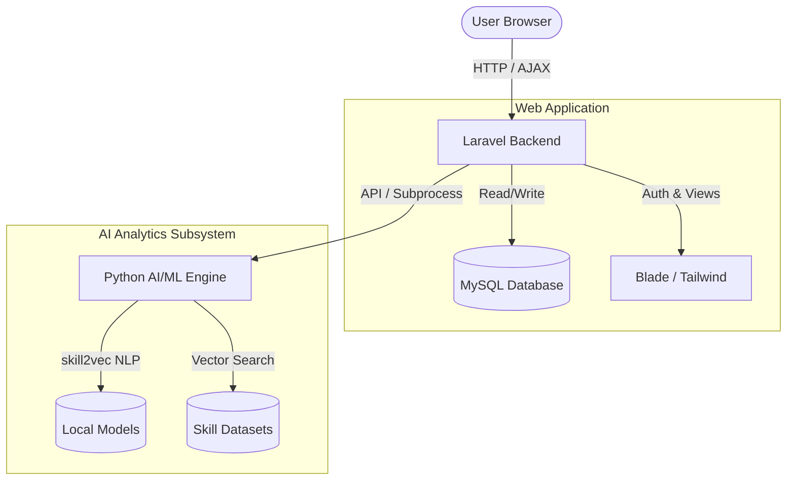

# EduCareer

A full-stack AI-powered career guidance platform bridging the gap between CVs and dream careers through intelligent skill extraction and mapping.

[](https://laravel.com)
[](https://www.python.org/)
[](LICENSE)

---

## Overview

EduCareer is an intelligent career guidance platform designed for job seekers, career advisors, and developers. It solves the problem of generic career advice by leveraging Natural Language Processing (NLP) to extract actual skills from a user's CV and map them against real-world industry requirements. 

By comparing a user's current skill set to the requirements of their target role, the platform provides data-driven career path recommendations, identifies specific skill gaps, and suggests targeted courses and jobs to bridge those gaps.

---

## Features

### Core Functionality
- **Smart CV Analysis:** Extract technical and soft skills directly from uploaded resumes using NLP.
- **Career Path Mapping:** AI-driven recommendations matching user profiles to viable career trajectories.
- **Skill Gap Visualization:** Dashboards highlighting missing skills required for target jobs.

### Recommendations
- **Dynamic Job Matching:** Recommends specific roles based on vector similarity (`skill2vec`).
- **Targeted Upskilling:** Suggests courses tailored to bridge individual skill gaps.

### Administration & Security
- **Role-Based Access Control (RBAC):** Distinct workflows for admins, career advisors, and standard users.
- **Authentication:** Secure login and registration.

### Developer Tooling
- **Customizable ML Engine:** Swap out the default embedding models for industry-specific fine-tuning.

---

## Scope and Limitations

### What it does
EduCareer successfully parses CVs, extracts skills, generates vector embeddings for those skills, and compares them against a predefined dataset of job roles and courses to generate personalized recommendations. It provides a complete web interface for users to interact with these insights.

### What it does not do
- **It does not automatically apply to jobs.**
- **It does not scrape live job boards.** Real-time job board integration requires connecting a third-party API (like LinkedIn or Indeed) to the existing endpoints.
- **It does not guarantee employment.** The platform is strictly an analytical guidance tool.

### Current Status
**Development / Beta** - The core functionality and ML pipelines are operational, but the project is actively evolving. 

---

## Tech Stack

### Frontend
- Blade Templating
- Tailwind CSS
- Alpine.js / Vue.js
- Vite

### Backend
- Laravel 12 (PHP 8.2)

### Database
- MySQL / SQLite

### AI & Machine Learning
- Python 3.x
- Gensim
- Scikit-Learn
- Pandas

---

## Architecture



---

## Requirements

- **PHP** >= 8.2
- **Composer** >= 2.x
- **Node.js** >= 18 and **npm** >= 9
- **Python** >= 3.9
- **MySQL** / **MariaDB** (or SQLite for local testing)

---

## Quick Start

### 1. Clone the repository
```bash
git clone https://github.com/mfarrukhjaved-381/educareer.git
cd educareer
```

### 2. Setup the Web Application (Laravel)
```bash
cd frontend-backend

# Install PHP and Node dependencies
composer install
npm install

# Configure environment variables
cp .env.example .env
php artisan key:generate

# Run database migrations
php artisan migrate

# Start the application
php artisan serve & npm run dev
```

### 3. Setup the AI/ML Engine (Python)
```bash
# Open a new terminal and navigate to the ML directory
cd ../ai-ml

# Create and activate a virtual environment
python3 -m venv venv
source venv/bin/activate  # On Windows: venv\Scripts\activate

# Install required ML packages
pip install pandas scikit-learn gensim numpy
```

---

## Configuration

Create a `.env` file in the `frontend-backend` directory based on `.env.example`.

| Variable | Required | Description | Example |
| -------- | -------- | ----------- | ------- |
| `APP_ENV` | Yes | Application environment | `local` |
| `DB_CONNECTION` | Yes | Database driver | `mysql` |
| `DB_DATABASE` | Yes | Database name or absolute SQLite path | `educareer` |
| `GOOGLE_CLIENT_ID` | No | OAuth Client ID for Google Login | `123...apps.googleusercontent.com` |
| `GOOGLE_CLIENT_SECRET` | No | OAuth Client Secret for Google Login | `GOCSPX-...` |

---

## Usage

### Running ML Scripts Manually
While the Laravel backend handles standard user interactions, developers can manually run or retrain the machine learning pipelines:

```bash
cd ai-ml
source venv/bin/activate

# Generate job recommendations based on a sample input
python scripts/job_recommendations.py

# Retrain the skill2vec model with updated datasets
python scripts/train_skill2vec.py
```

---

## Development

To format and work on the Laravel application locally:

```bash
# Compile frontend assets for development
npm run dev

# Build frontend assets for production
npm run build

# Clear application cache
php artisan optimize:clear
```

---

## Testing

Run the automated test suite for the Laravel backend:

```bash
cd frontend-backend

# Run Unit & Feature tests
php artisan test
```

---

## Roadmap

- [x] User Authentication & Dashboard
- [x] CV Parsing & NLP Skill Extraction
- [x] Job & Course Recommendation Engine
- [ ] Implement Redis caching for faster ML model loading
- [ ] Build standalone REST API for mobile app integration
- [ ] Implement OAuth integrations (LinkedIn, Google)

---

## Contributing

Contributions are welcome.

Please ensure you follow standard Laravel and Python coding conventions. 
1. Fork the repository
2. Create your feature branch (`git checkout -b feature/AmazingFeature`)
3. Ensure all tests pass (`php artisan test`)
4. Commit your changes
5. Open a Pull Request

---

## License

This project is licensed under the MIT License.
See [LICENSE](LICENSE) for details.

---

## Maintainers

**Muhammad Farrukh Javed**
- GitHub: [https://github.com/mfarrukhjaved-381](https://github.com/mfarrukhjaved-381)
- Portfolio: [https://mfarrukhjaved.com/](https://mfarrukhjaved.com/)
